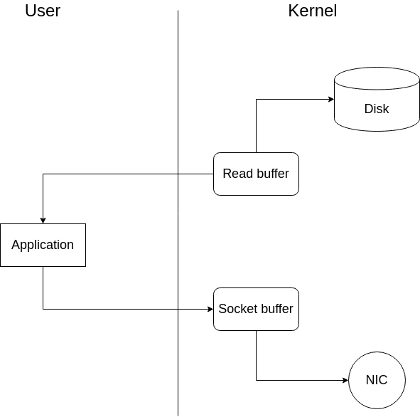
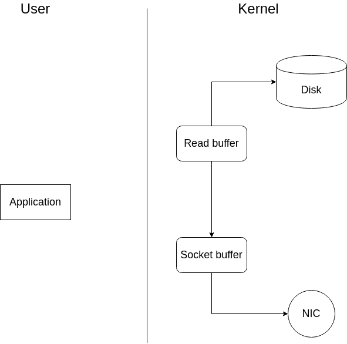

# Apache Kafka

## Apache Kafka là gì?
### Giới thiệu về Kafka
**Kafka** hay **Apache Kafka** là một *nền tảng dòng dữ liệu phân tán* (distributed streaming platform) với 03 chức năng chính sau: 
1. Publish và subcribe vào stream của các bản ghi.
2. Lưu trữ stream của các bản nghi bằng phương pháp *dung lỗi* (fault-tolerant).
3. Xử lý các stream của các bản ghi khi có bản ghi mới.

Một server Kafka được gọi là một **blocker**. Ta có thể chạy song song nhiều **blocker** với nhau. Các **blocker** được chạy song song sẽ cùng trỏ tới một **Zookeeper**(một dịch vụ của Apache dùng để quản lý và bố trí các **blocker**), gọi là cụm **blocker** (hay **cluster**).
### Cấu trúc của Kafka
Một mô hình cấu trúc Kafka sẽ bao gồm các **producer** (nơi tạo ra gói tin và chuyển gọi tin lên các blocker) và các **consumers** (nơi nhận các gói tin từ các **blocker**). Các gói tin khi được publish sẽ được chứa trong các **topic** ở **blocker** và các **consumer** sẽ subcribe các **topic** để nhận được các gói tin.

 Trên thực tế  một **topic** có thể có dung lượng rất lớn. Do đó, thay vì lưu tất cả vào một chỗ, Kafka sẽ chia **topic** ra thành nhiều phần nhỏ, gọi là các **partition**. Các **partition** của một topic sẽ được lưu trữ trên nhiều broker khác nhau, hạn chế việc mất mát dữ liệu cũng như cho phép nhiều **consumer** subcribe một **topic** song song. Hình bên dưới mô tả quá trình publish/subcribe trên Kafka.

### Cái nhìn sâu hơn về Partition
Một **partition** sẽ được hiện thực theo hướng dãy *có thứ tự* (ordered) và *bất biến* (immutable) như một **commit log**. Cụ thể hơn, mỗi bản ghi trong **partition** được định danh bằng một chỉ số tuần tự độc nhất gọi là **offset** và Kafka chỉ hỗ trợ thao tác nối dài cho partition. Kafka sẽ duy trì các bản ghi trong partition trong một thời gian nhất định, không quan tâm bản ghi đó có được sử dụng hay không. Sau thời gian này, bản ghi sẽ được Kafka xóa để giải phóng bộ nhớ.

Để đề phòng trường hợp hư hỏng dữ liệu, một **partition** sẽ có ít nhất một **replica** được lưu trữ ở một broker khác. Khi **partition** gốc, còn gọi là **leader partion**, bị lỗi thì một trong những **replica partion** của nó sẽ lên thay.

![Leader&Replica]](Images/Leader_Replica.jpg)

Tất cả các hành động publish và subcribe đều phải thông qua **leader partition**, và **leader partition** phải cập nhật cho các **replica** về nhũng thay đổi trong dữ liệu lưu trữ. Để hỗ trợ cho việc publish/subcribe của **producer/consumer** thì thông tin của **leader partition** bởi **Zookeeper**.

### Ứng dụng của Kafka

Kafka được sử dụng chủ yếu để hiện thực hai chức năng sau:
1. Xây dụng một dòng dữ liệu thời gian thực để gửi/nhận dữ liệu giữa server và ứng dụng.
2. Xây dựng các ứng dụng stream để biến đổi hoặc ánh xạ các stream của dữ liệu.
## Tại sao lại sử dụng Kafka?
### Độ trễ I/O thấp
Một cách được sử dụng phổ biến để giảm độ trễ I/O trong gửi nhận gói tin là sử dụng RAM. Với tốc độ đọc ghi nhanh chóng của RAM, cách này thực sự đã làm giảm độ trễ I/O. Tuy nhiên, tài nguyên RAM đắt hơn nhiều so với tài nguyên đĩa. Để vừa tiết kiếm tài nguyên vừa đặt độ trễ I/O thấp, Kafka sử dụng hoàn toàn đĩa và vùng nhớ đệm với phương pháp **Sequence I/O**.

### Truyền bản ghi nhanh với Zero-copy
Theo một cách truyền thống, để gửi lấy một dữ liệu từ đĩa lên và gửi lên cho **broker**, kernel sẽ lấy dữ liệu từ đĩa lên buffer. Sau đó, kernel sẽ chuyển ngữ cảnh sang cho user và đưa dữ liệu lên ứng dụng. Ứng dụng sau khi nhận được dữ liệu lại tiếp tục gửi dữ liệu lên socket và chuyện ngữ cảnh sang cho kernel. Tới đây kernel lại phải tiếp tục gửi dữ liệu đến NIC và từ đó gửi lên mạng. Hình bên dưới diễn tả phương pháp này.

Cứ mỗi lần thực hiển chuyển ngữ cảnh, chu kỳ CPU và băng thông sẽ bị chiếm dụng, dẫn đến hiệu năng bị hạ thấp. Để xử lý vấn đề này, Kafka sẽ yêu cầu kernel gửi trực tiếp dữ liệu tới socket mà không cần thông qua ứng dụng.

### Gom nhóm gói tin

Kafka có hỗ trợ cho phép các phương thức network gom nhóm các gói tin, giúp tiết kiệm tài nguyên mạng. Producer sẽ gom nhóm các gói tin lại và consumer cũng sẽ tìm để subcribe nhiều gói tin cùng lúc, giảm thiểu tải đĩa.

## Kết luận

Kafka đang nhanh chóng trở thành trụ cột của đường ống dữ liệu đối với bất kỳ tổ chức nào. Kafka cho phép có một lượng lớn các gói tin đi qua một phương tiện tập trung và lưu trữ chúng mà không cần phải lo lắng gì về những vấn đề như hiệu suất hay mất mát dữ liệu. Kafka có thể là thành phần trung tâm trong mô hình kiến trúc hướng sự kiện và cho phép bạn phân tách giữa ứng dụng này với ứng dụng khác.