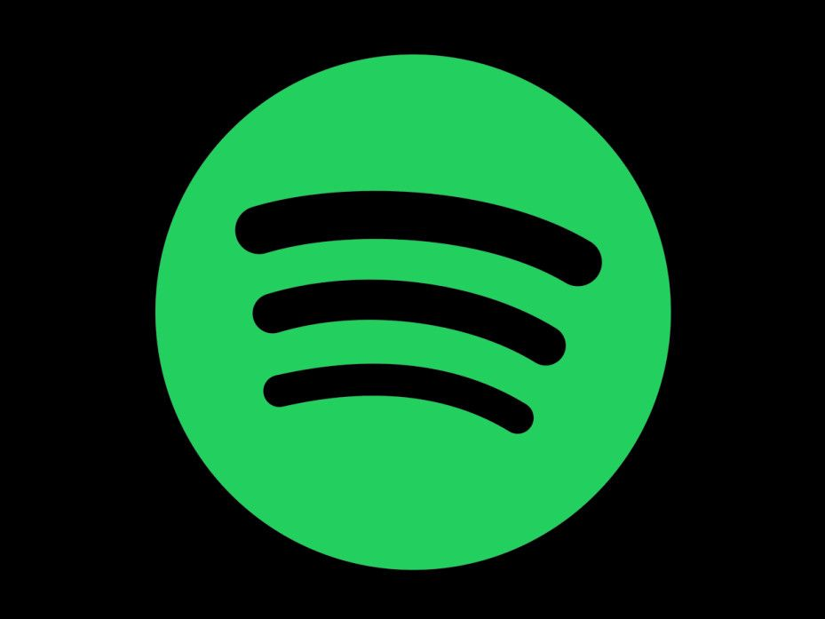
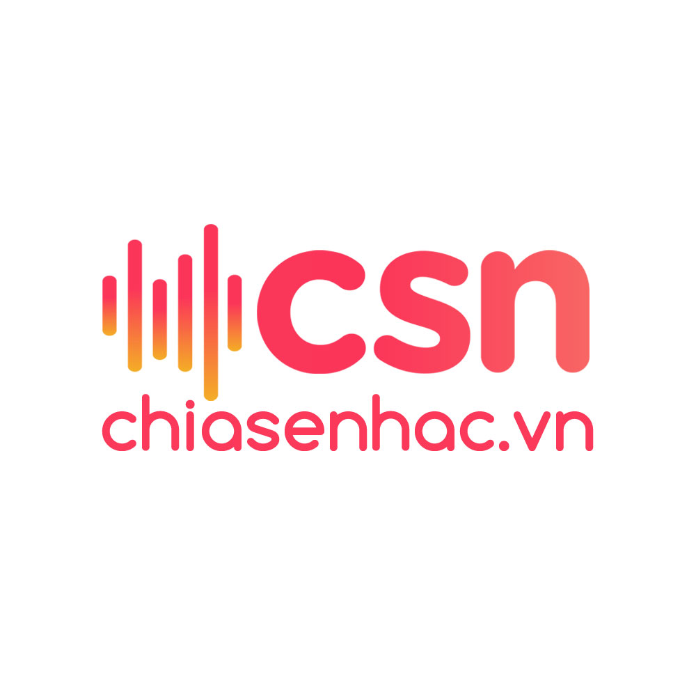
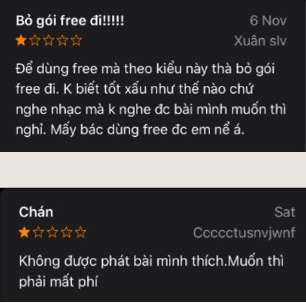

# Ứng dụng nghe nhạc trên điện thoại

## Giới thiệu
Trong những thập kỷ qua, thế giới đã chứng kiến những bước nhảy vọt đáng kinh ngạc trong lĩnh vực công nghệ. Một trong những thiết bị có tốc độ phát triển nhanh nhất có thể kể đến là điện thoại di động. Hãy lấy Iphone làm ví dụ. Vào năm 2007, Apple tung ra thị trường những chiếc Iphone 2G đầu tiên, thứ mà thời bấy giờ được xem như là phép màu công nghệ với những tính năng vô cùng cơ bản như nghe, gọi, chụp ảnh... Chỉ một thập kỷ sau đó, vào năm 2017, sản phẩm mới nhất của Apple là IphoneX ra đời với hàng ngàn các tính năng đặc sắc, hơn hẳn thiết bị đã từng là phép màu mười năm về trước.

Sự phát triển vượt bậc này đã khiến cho điện thoại di động trở thành một phần tất yếu của cuộc sống con người. Chúng ta sử dụng điện thoại để xem phim, chơi game, lướt web,... hầu như mỗi ngày. Và có một tính năng mà hầu hết những người sở hữu điện thoại đều sử dụng. Đó là nghe nhạc trên điện thoại.

Việc sở hữu cho mình một ứng dụng nghe nhạc trên điện thoại gần như là một điều tất yếu đối với tất cả mọi người. Blog này sẽ giới thiệu về hai trường phái ứng dụng nghe nhạc và góc nhìn của bản thân mình về ảnh hưởng của chúng.
## Spotify - Thiên đường của âm nhạc có bản quyền
Sáng lập vào năm 2008 bởi Daniel Ek và Martin Lorentzon, Spotify là một trong những nền tảng nghe nhạc nhiều người dùng nhất trên thế giới. Spotify hiện đã có mặt tại 79 quốc gia trên thế giới, bao gồm cả Việt Nam từ năm 2018.

Để có thể thu hút được hơn 270 triệu người dùng trên toàn thế giới, Spotify đã làm nổi bật những ưu điểm sau:
1. Chất lượng nhạc trên Spotify có thể được điều chỉnh bởi người sử dụng. Chất lượng tối đa của những bài nhạc là 320 kbps. Tuy nhiên, để đạt được chất lượng này thì người dùng phải trả một khoản phí hàng tháng cho Spotify.
2. Xây dụng trải nghiệm nghe nhạc cá nhân hóa cho người dùng. Cụ thể hơn, người dùng sẽ được xây dựng trải nghiệm nghe nhạc dựa trên sở thích của chính bản thân họ.
3. Cho phép người dùng trả phí tải nhạc không giới hạn và nghe nhạc ngoại tuyến. Tuy nhiên, việc tải nhạc sẽ bị mã hóa, đảm bảo chỉ tài khoản tải nhạc có thể mở được file nhạc và chỉ có thể mở bằng Spotify.

## chiasenhac - Thánh địa của những file nhạc chất lượng cao

chiasenhac là một nền tảng nghe nhạc trên browser thuần Việt. chiasenhac cung cấp gần như tất cả những bài hát mà bạn có thể tìm được trên youtube hoặc google. Cũng như Spotify, chiasenhac có những ưu điểm của riêng nó khiến nó thu hút rất nhiều người dùng ở Việt Nam.
1. chiasenhac cung cấp những bài nhạc có chất lượng lossless (hơn 1200 kbps). Bên cạnh đó, người dùng có thể nghe nhạc chất lượng cao hoàn toàn miễn phí.
2. Việc tải nhạc trên chiasenhac là không có giới hạn. Bạn hoàn toàn có thể sở hữu một file nhạc lossless của bất cứ bài hát nào bạn yêu thích.

## Sự khác biệt - Bản quyền âm nhạc

Như đã trình bày ở phần trên, Spotify là thiên đường của âm nhạc có bản quyền. Điều này có nghĩa là tất cả những bài hát có mặt trên ứng dụng đều nhận được sự đồng ý của người tạo ra chúng. Spotify cũng sẽ trả tiền bản quyền cho những người sáng tác. Nhìn chung, cơ chế kinh doanh của Spotify là hoàn toàn hợp pháp.

chiasenhac có vẻ như đã làm dấy lên rất nhiều nghi vấn về bản quyền khi cung cấp một dịch vụ nghe nhạc tuyệt vời, khả năng tải nhạc không giới hạn với cái giá 0 đồng. Bên cạnh đó, không một thông báo tường minh về những bản hợp đồng bản quyền cũng làm "khẳng định hóa" những nghi vấn.

## Những hành động tiêu cực

Việc sử dụng một dịch vụ nghe nhạc miễn phí một thời gian dài đã khiến nhiều người mặc định rằng __âm nhạc là miễn phí__. Điều này dẫn đến một vài hành động tiêu cực nhằm phản đối _một ứng dụng nghe nhạc trả phí ra mắt ở Việt Năm năm 2018_.

## Kết

__Âm nhạc hoàn toàn không miễn phí__. Để sản xuất ra được một bài hát cần tốn rất nhiều thời gian, tiền bạc và công sức. Do đó, hãy tôn trọng tác giả và bản quyền tác giả khi sử dụng bài hát của họ cho bất cứ mục đích gì.